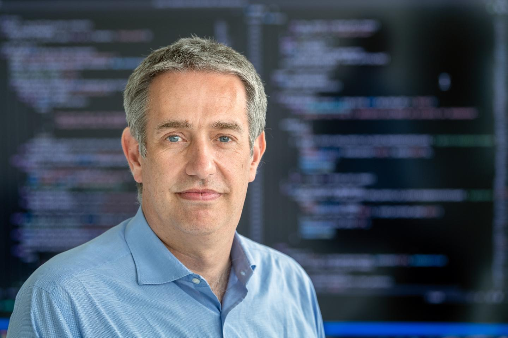
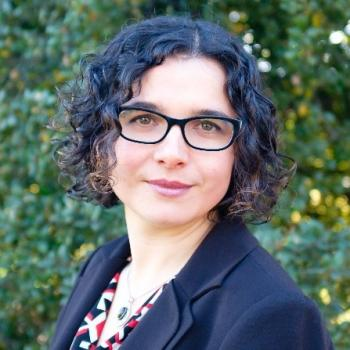
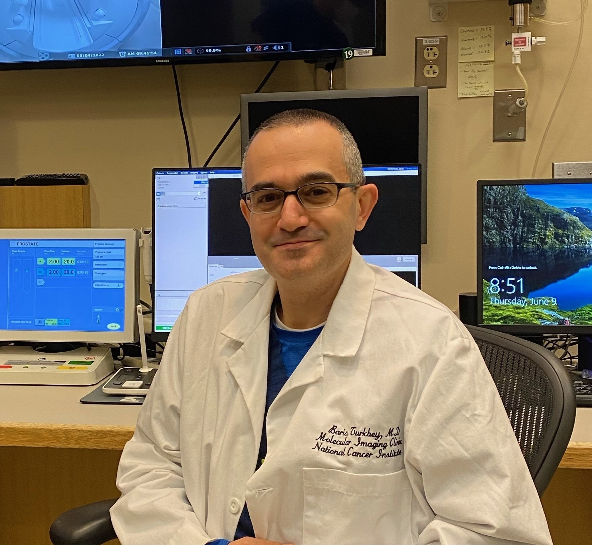
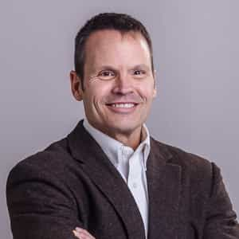



# Keynote speakers

## [Prof. Tal Arbel, Ph.D.](https://www.cim.mcgill.ca/~arbel/){: width="180" }
### Professor, Department of Electrical and Computer Engineering, McGill University

<!--
#### 
### **Title**

**Abstract:** 

**Biography:** 

<!--{{ video("https://video.midl.io/2022/keynote1.mp4") }}-->
-->

***

## [Prof. Daniel Rueckert]((https://www.professoren.tum.de/rueckert-daniel)), PhD {: width="180" }
### Professor in Artificial Intelligence in Healthcare and Medicine
### Technical University of Munich and Imperial College London

<!--
#### 
### **Title**

**Abstract:** 

**Biography:** 

<!--{{ video("https://video.midl.io/2022/keynote1.mp4") }}-->
-->

***

## 	[Prof. Mirabela Rusu, Ph.D.](https://profiles.stanford.edu/mirabela-rusu){: width="180" }
### Assistant Professor of Radiology, Standford University

<!--
#### 
### **Title**

**Abstract:** 

**Biography:** 

<!--{{ video("https://video.midl.io/2022/keynote1.mp4") }}-->
-->

***

## [Dr. Ismail Baris Turkey, M.D.](https://ccr.cancer.gov/staff-directory/ismail-baris-turkbey#qt-staff_profile_tabs-ui-tabs6){: width="180" }
### Director of the Artificial Intelligence Resource (AIR), Senior Clinician
### Center for Cancer Research, National Cancer Institute (NCI), National Institutes of Health (NIH)

<!--
#### 
### **Title**

**Abstract:** 

**Biography:** 

<!--{{ video("https://video.midl.io/2022/keynote1.mp4") }}-->
-->

***

## [Dr. Stephen Aylward, Ph.D.](https://www.aylward.org){: width="180" }
### Global Alliance Manager Developer Relations: MedTech Ecosystem, NVIDIA
### Adjunct Associate Professor of Computer Science, University of North Carolina - Chapel Hill

<!--
#### 
### **Title**

**Abstract:** 

**Biography:** 

<!--{{ video("https://video.midl.io/2022/keynote1.mp4") }}-->
-->
